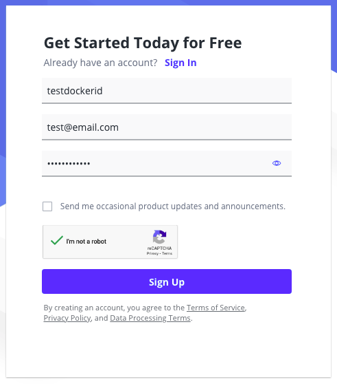
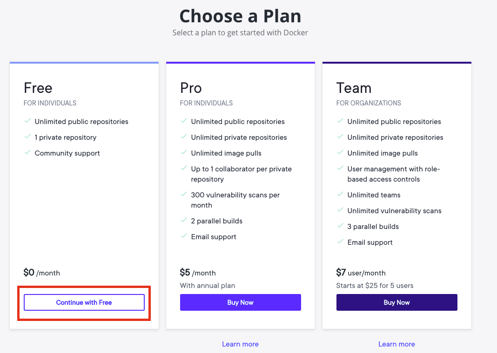
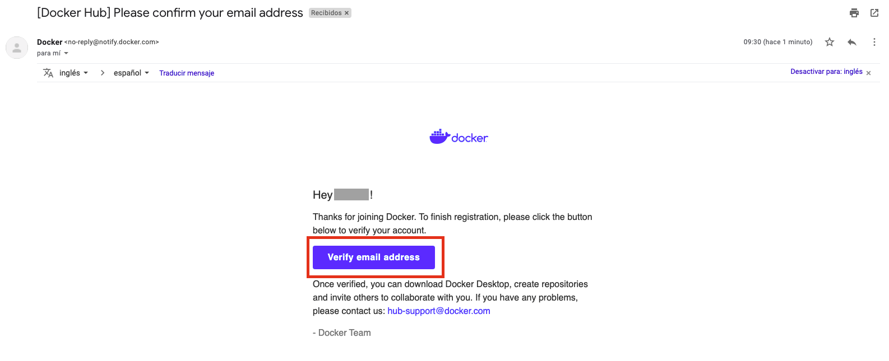
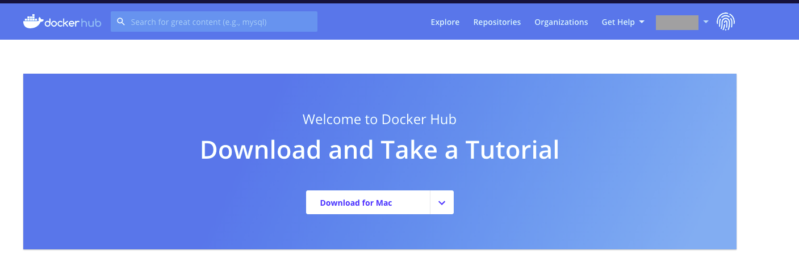

# CI/CD Demo

## Requirements

The following are the requirements you need to proceed with this demo, from point 1 to 5 is explained below. 
For point 6, please go to the official documentation if you do not have already an IDE installed. 
Enjoy :)

1. [DockerHub account](#DockerHub-account)
2. [Github account](#Github-account)
3. [Heroku account](#Heroku-account)
4. [Git installed](#Git-installation)
5. [Docker installed](#Docker-installation)
6. Javascript IDE installed ([Visual Studio Code Editor](https://code.visualstudio.com/download), [Atom](https://atom.io/), [Sublime](https://www.sublimetext.com/3))

### DockerHub account

1. Go to [oficial page](https://hub.docker.com/)
2. Fill the form, for example:

3. Select free plan

4. You'll receive a confirmation message to your mail. Please verify your email

And that's it, now you have your **DockerHub account** :D

### Github account

1. Go to [oficial page](https://github.com/)
2. Click on **Sign Up**

3. Fill the form

4. Customize your profile (below is just an example)

5. You'll receive an email, please click on **verify email address**

And that's it, now your **Github account** is ready to be used

### Heroku account

1. Go to [oficial page](https://id.heroku.com/login)
2. Click on **Sign Up**

3. Fill the form

4. You'll receive an email, please click on **verify email address**

And that's it, now your **Heroku account** is ready

### Git installation

For this you can go to the [official page](https://git-scm.com/downloads), select your os and install it :D

if you're more a cli kind person, go to [this](https://git-scm.com/book/en/v2/Getting-Started-Installing-Git) page to install it ;)

### Docker installation

According with your os, please go to the oficial pages to install Docker on your pc

- [Mac](https://docs.docker.com/docker-for-mac/install/)
- [Windows](https://docs.docker.com/docker-for-windows/install/)
- [Linux](https://docs.docker.com/engine/install/)
