# CI/CD Demo

## ¿Cómo funciona?


## Requisitos

Para realizar nuestro demo, necesitas crear solo un par de cuentas, en ésta sección encontrarás cómo hacerlo

1. [Cuenta en Github](#Cuenta-en-Github)
2. [Cuenta en Heroku](#Cuenta-en-Heroku)

### Cuenta en Github

1. Ve a la [página oficial](https://github.com/)
2. Da click en **inscrbirse** (**Sign Up**)


3. Llena el formato con tus datos

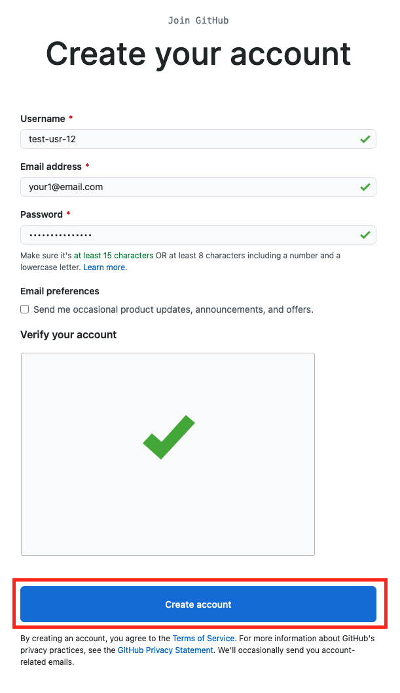

4. Personaliza tu perfil (la siguiente imagen es un ejemplo)


5. Recibirás un correo para verificar tu cuenta, da click en **verificar email** (**verify email address**)

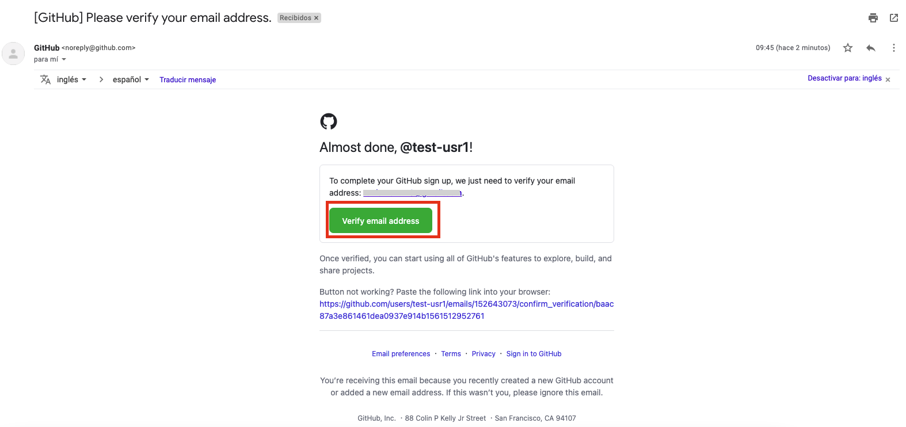

Y eso es todo, ahora tu **Cuenta de Github** está lista para usarse

### Cuenta en Heroku

1. Ve a la [página oficial](https://id.heroku.com/login)
2. Da click en **inscrbirse** (**Sign Up**)


3. Llena el formato con tus datos


4.  Recibirás un correo en tu bandeja de entrada, da click en **verificar email** (**verify email address**)

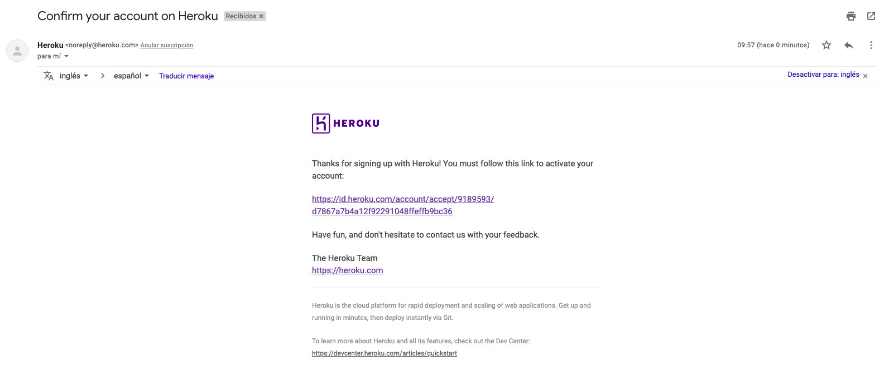

Y eso es todo, ahora tienes una **cuenta en Heroku** lista para usarse

## Instrucciones

1. Hacer fork de este proyecto en tu propia cuenta, para ello tienes que dar clic en "Fork".


2. Posteriormente seleccionas tu cuenta personal para hacer fork (este proceso puede tardar un par de segundos)


3. Una vez que termine de hacer el fork de nuestro proyecto, tenemos que ir a la parte de **"Actions"** y tenemos que habilitar las acciones en nuestro repo, para ello damos clic en el botón verde, como en la siguiente imagen

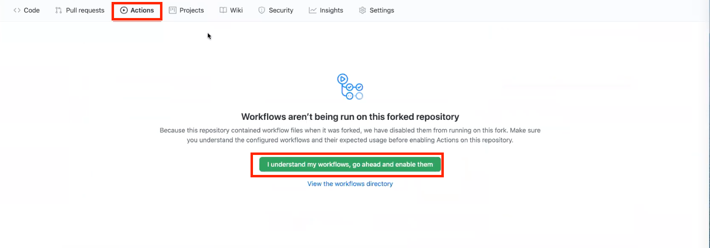

4. Una vez que las habilitemos adecuadamente, nosotros seremos capaces de ver la siguiente pantalla

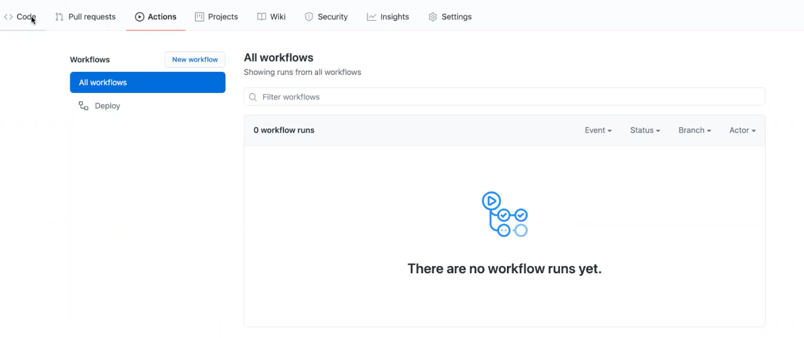

5. El siguiente paso será configurar tus credenciales de Heroku en Github

Para esto crearemos 3 variables o como se le conoce en Github, secrets

```
HEROKU_API_KEY
HEROKU_APP_NAME
HEROKU_EMAIL
```

Te diriges a Configuración > secretos > nuevo secreto

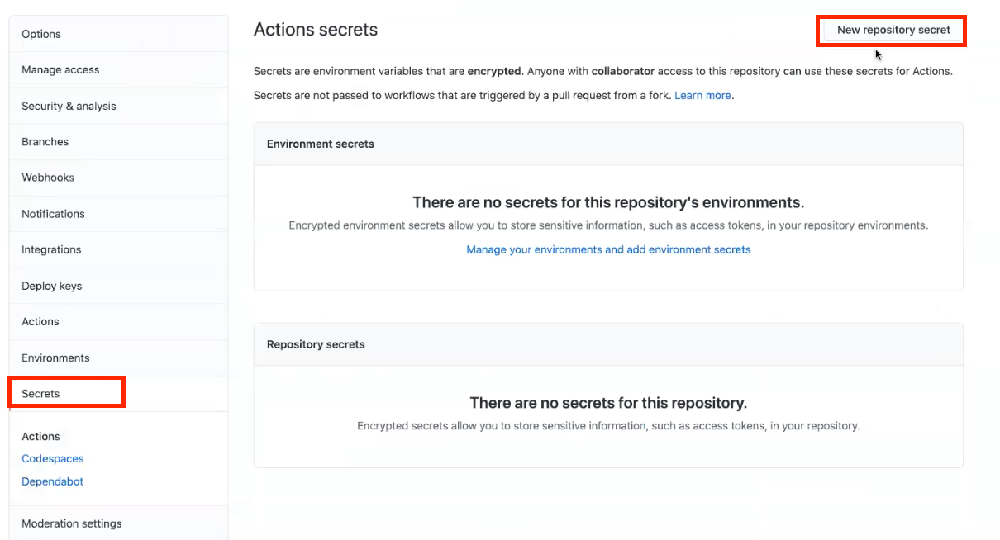

Y colocas el nombre del secreto, por ejemplo **HEROKU_EMAIL** y colocas el email con el que te registraste en Heroku

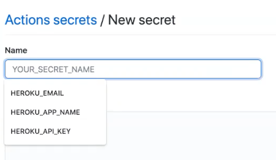

Para **HEROKU_API_KEY** y **HEROKU_APP_NAME** tenemos que ir a Heroku, entrar a configuración de la cuenta

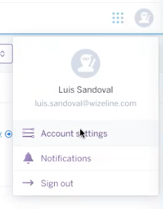

Y vas a la sección de API Key > seleccionas **revelar** y copias el valor en la variable en github


Para generar el APP_NAME necesitamos crear una aplicación en Heroku, damos clic en el logo de Heroku para ir a la página principal y le damos nuevo > crear nueva app


Seleccionas un nombre, el que tú quieras

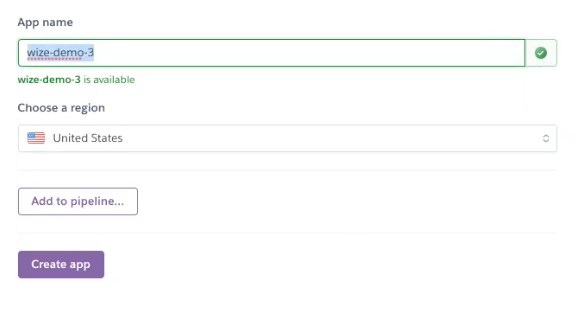

Ese nombre que usaste es el que debe de ir en **HEROKU_APP_NAME**

Una vez creada tu app, puedes entrar y dar clic en **open app** o **abrir app**. Y verás desplegado una página de prueba, ésta será substituida por la que tenemos en el repo

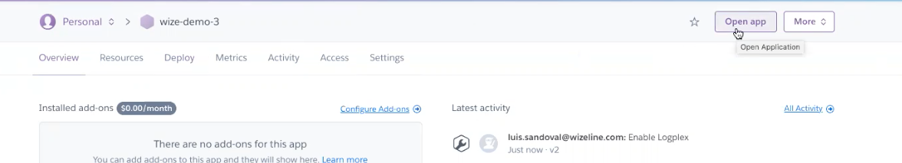

6. Una vez configurado los secretos, ahora usando GitHub vamos a hacer un cambio en la app, para ello vamos a la carpeta de app/views/index.html y seleccionas el lápiz para editar el archivo.

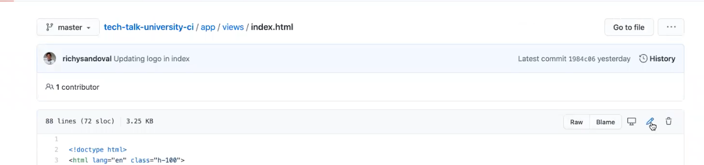

Puedes realizar cualquier cambio y realizas el commit

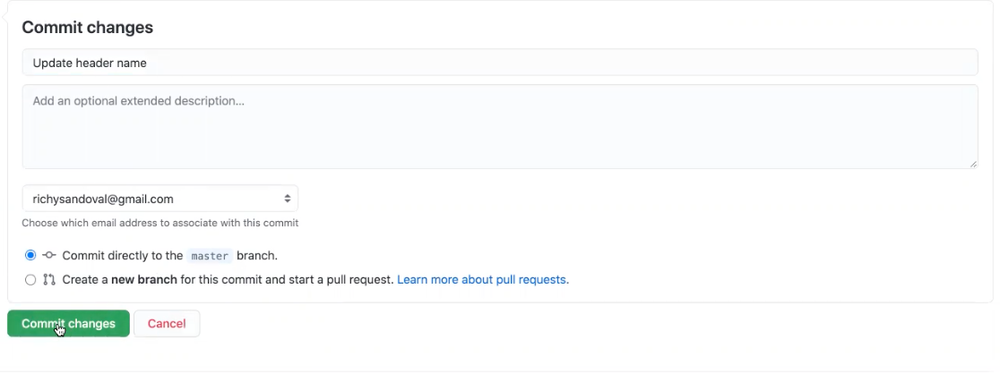

7. Posteriormente vamos a Acciones del repositorio y podremos ver todo el proceso de deployment del proyecto

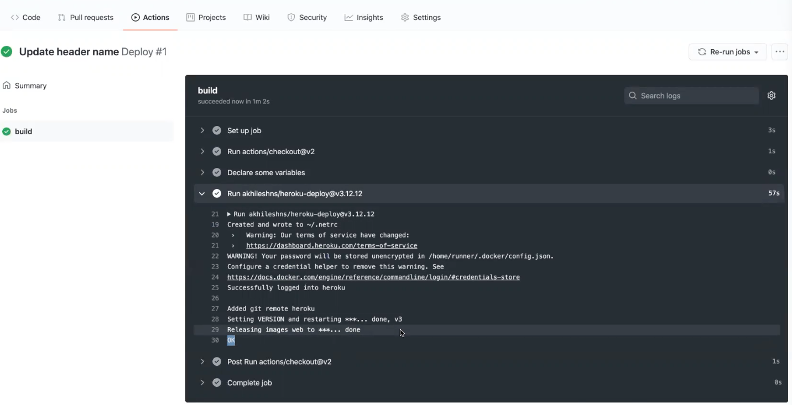

8. Por último puedes ir de nuevo al url o a tu app en Heroku como se hizo en el paso 5 (abrir app) y deberá mostrar nuestra aplicación


Y eso es todo! Ya tienes una app corriendo en un container y desplegada en Heroku :D
